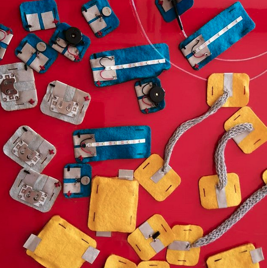

# Wearables

## Welcome

Welcome to the Wearable Technology Interest Group at DoESLiverpool

This is a seperate [Wearable Wiki](https://github.com/DoESLiverpool/wearables/wiki) building on the main [DoESLiverpool wiki](https://github.com/DoESLiverpool/somebody-should/wiki)

### Everyone is welcome - it's free!

If you've never stitched a circuit before then come along and someone will be happy to show you how. We have a box of wearable-related items you can experiment with - including fabrics, wearable microcontrollers, conductive thread, sewable LEDs, and interesting sensors.

### When do we do it?

The **Wearable Tech group** meets at **7pm** on the **second and fourth Tuesday** of each month, at [DoES Liverpool](https://doesliverpool.com/location/).

Check the [calendar](http://doesliverpool.com/calendar/) if in doubt.

### What Are We Doing?

* [Making Natural Dyes](https://github.com/DoESLiverpool/Wearables/wiki/Making-Natural-Dyes) This is our current low tech lockdown activity (as we can't easily get at our ESPs and neopixels at the moment). It's cheap and easy to join in and has lots of potential uses
* [BioMaterials](https://github.com/DoESLiverpool/Wearables/wiki/Bio-Materials) A sub group of the Wearable group looking into DIY bio-tech
* [Wearable Tech Workshops](https://github.com/DoESLiverpool/WearableTechBadgeWorkshop) Workshop introducing Wearable tech with 555 timers and ESP8266/32 and fabric switches 
